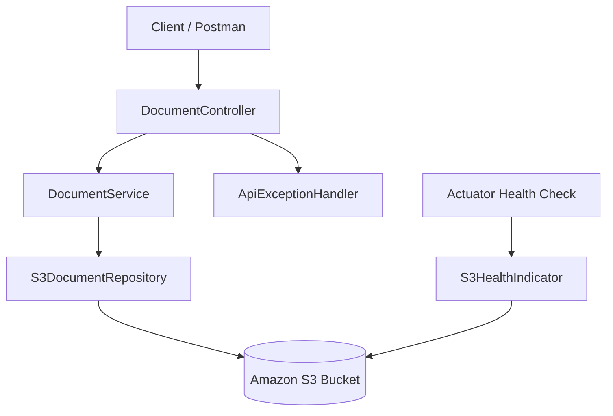

# S3 Document Service

A Spring Boot REST API for storing, retrieving, listing, and deleting JSON documents in Amazon S3.

The service uses S3 as the document store. Each document is saved under a safe key, stored as JSON, and scoped under a configurable S3 prefix.

---

## Features

- Store JSON documents in Amazon S3
- Retrieve documents by key
- Delete documents by key
- List documents by prefix with pagination support
- Safe key validation for S3 object names
- Server-side encryption using SSE-S3
- Centralized API error handling
- Spring Boot Actuator health checks
- Maven-based build and test workflow
- GitHub Actions CI workflow
- Jenkins pipeline support
- Terraform infrastructure for S3 buckets and IAM policy

---

## Tech Stack

| Area | Technology |
|---|---|
| Language | Java 17 |
| Framework | Spring Boot 3 |
| API | Spring Web REST |
| Validation | Jakarta Validation |
| JSON Handling | Jackson |
| Cloud Storage | Amazon S3 |
| AWS SDK | AWS SDK v2 |
| Monitoring | Spring Boot Actuator |
| Testing | JUnit 5, Spring Boot Test, Mockito, MockMvc |
| Build Tool | Maven |
| CI/CD | GitHub Actions, Jenkins |
| Infrastructure | Terraform |

---

## Architecture



---

## Project Structure

```text
s3-document-service
├── .github
│   └── workflows
│       └── ci.yml
├── infra
│   ├── app
│   │   ├── main.tf
│   │   ├── variables.tf
│   │   ├── outputs.tf
│   │   └── versions.tf
│   └── bootstrap
├── src
│   ├── main
│   │   ├── java/com/triageagent/s3docs
│   │   │   ├── config
│   │   │   │   ├── S3Config.java
│   │   │   │   └── S3Properties.java
│   │   │   ├── health
│   │   │   │   └── S3HealthIndicator.java
│   │   │   ├── s3
│   │   │   │   └── S3DocumentRepository.java
│   │   │   ├── service
│   │   │   │   └── DocumentService.java
│   │   │   ├── web
│   │   │   │   ├── ApiExceptionHandler.java
│   │   │   │   ├── DocumentController.java
│   │   │   │   └── NotFoundException.java
│   │   │   └── S3DocsApplication.java
│   │   └── resources
│   │       └── application.yml
│   └── test
│       └── java/com/triageagent/s3docs
├── Jenkinsfile
├── pom.xml
└── README.md
```

---

## API Endpoints

Base path:

```text
/api/v1/docs
```

| Method | Endpoint | Description |
|---|---|---|
| `PUT` | `/api/v1/docs/{key}` | Create or update a JSON document |
| `GET` | `/api/v1/docs/{key}` | Retrieve a JSON document |
| `DELETE` | `/api/v1/docs/{key}` | Delete a JSON document |
| `GET` | `/api/v1/docs` | List stored documents |

---

## Key Rules

Document keys must match this pattern:

```text
^[a-zA-Z0-9._-]{1,128}$
```

Valid keys:

```text
customer-123
invoice_2025
policy.demo
```

Invalid keys:

```text
customer/123
my document
../../secret
```

The application automatically stores documents in S3 using this format:

```text
{S3_PREFIX}{key}.json
```

Example:

```text
dev-docs/customer-123.json
```

---

## Example API Usage

### Create or Update a Document

```bash
curl -X PUT http://localhost:8080/api/v1/docs/customer-123 \
  -H "Content-Type: application/json" \
  -d '{"name":"Sai","type":"customer","active":true}'
```

Expected response:

```text
204 No Content
```

The response includes an `ETag` header from S3.

---

### Get a Document

```bash
curl http://localhost:8080/api/v1/docs/customer-123
```

Example response:

```json
{
  "name": "Sai",
  "type": "customer",
  "active": true
}
```

---

### List Documents

```bash
curl "http://localhost:8080/api/v1/docs?startsWith=customer&maxKeys=10"
```

Example response:

```json
{
  "items": [
    {
      "key": "customer-123",
      "lastModified": "2026-01-01T10:00:00Z",
      "eTag": null
    }
  ],
  "nextContinuationToken": null
}
```

Supported query parameters:

| Parameter | Description |
|---|---|
| `startsWith` | Filters documents by key prefix |
| `maxKeys` | Maximum number of documents to return |
| `continuationToken` | Token used to fetch the next page |

---

### Delete a Document

```bash
curl -X DELETE http://localhost:8080/api/v1/docs/customer-123
```

Expected response:

```text
204 No Content
```

---

## Configuration

Configuration is handled through `application.yml` and environment variables.

```yaml
server:
  port: 8080

management:
  endpoints:
    web:
      exposure:
        include: health,info,metrics,prometheus

aws:
  region: ${AWS_REGION:us-east-1}

app:
  s3:
    bucket: ${S3_BUCKET:your-s3-bucket-name}
    prefix: ${S3_PREFIX:dev-docs/}
```

Recommended local environment variables:

```bash
export AWS_REGION=us-east-1
export S3_BUCKET=your-s3-bucket-name
export S3_PREFIX=dev-docs/
```

For Windows PowerShell:

```powershell
$env:AWS_REGION="us-east-1"
$env:S3_BUCKET="your-s3-bucket-name"
$env:S3_PREFIX="dev-docs/"
```

---

## AWS Credentials

The app uses the default AWS credential provider chain.

You can authenticate using one of these options:

- AWS CLI profile
- Environment variables
- IAM role on EC2/ECS/EKS
- AWS SSO-based local profile

Example using AWS CLI:

```bash
aws configure
```

Verify access:

```bash
aws sts get-caller-identity
```

---

## Run Locally

### Windows

```powershell
mvnw.cmd spring-boot:run
```

### macOS / Linux

```bash
./mvnw spring-boot:run
```

The service starts on:

```text
http://localhost:8080
```

---

## Health Check

Spring Boot Actuator exposes health information at:

```text
http://localhost:8080/actuator/health
```

Example response:

```json
{
  "status": "UP"
}
```

The custom S3 health indicator checks whether the configured S3 bucket is reachable.

---

## Run Tests

```bash
mvn clean test
```

The test suite includes:

- Application context loading test
- Service-layer unit test
- Controller integration test using MockMvc

---

## CI/CD

### GitHub Actions

The GitHub Actions workflow runs on pushes and pull requests to `master` and `main`.

It performs:

- Java 17 setup
- Maven build and tests
- Terraform format check

### Jenkins

The `Jenkinsfile` includes stages for:

- Checkout
- Build and unit tests
- Terraform formatting check
- JUnit test report publishing

---

## Terraform Infrastructure

Terraform code is available under:

```text
infra/app
```

It creates:

- S3 bucket for documents
- S3 bucket for build/artifact storage
- Public access blocking
- Bucket versioning
- Server-side encryption
- TLS-only bucket policy
- Least-privilege IAM policy for app access

### Terraform Commands

```bash
cd infra/app
terraform init
terraform fmt -recursive
terraform validate
terraform plan
terraform apply
```

After applying, Terraform outputs values such as:

```text
docs_bucket_name
artifacts_bucket_name
docs_prefix
app_policy_arn
```

Use the `docs_bucket_name` value as your `S3_BUCKET`.

---

## Error Handling

The API returns structured error responses using Spring `ProblemDetail`.

Common cases:

| Status | Reason |
|---|---|
| `400 Bad Request` | Invalid key or invalid request |
| `404 Not Found` | Document does not exist |
| `500 Internal Server Error` | Unexpected server or AWS error |

Example 404 response:

```json
{
  "type": "about:blank",
  "title": "Not Found",
  "status": 404,
  "detail": "Document not found: customer-123"
}
```

---

## Security Notes

- S3 objects are stored with server-side encryption.
- Terraform blocks public access on the S3 buckets.
- Terraform adds a TLS-only bucket policy.
- The app IAM policy is limited to the configured document prefix.
- Do not commit AWS credentials or secrets to the repository.

---

## Future Improvements

- Add OpenAPI/Swagger documentation
- Add request/response examples for all error cases
- Add LocalStack support for local S3 testing
- Add Dockerfile and Docker Compose setup
- Add deployment workflow to AWS
- Add structured logging and tracing
- Add object tagging or metadata support

---

## License

This project is licensed under the MIT License.
